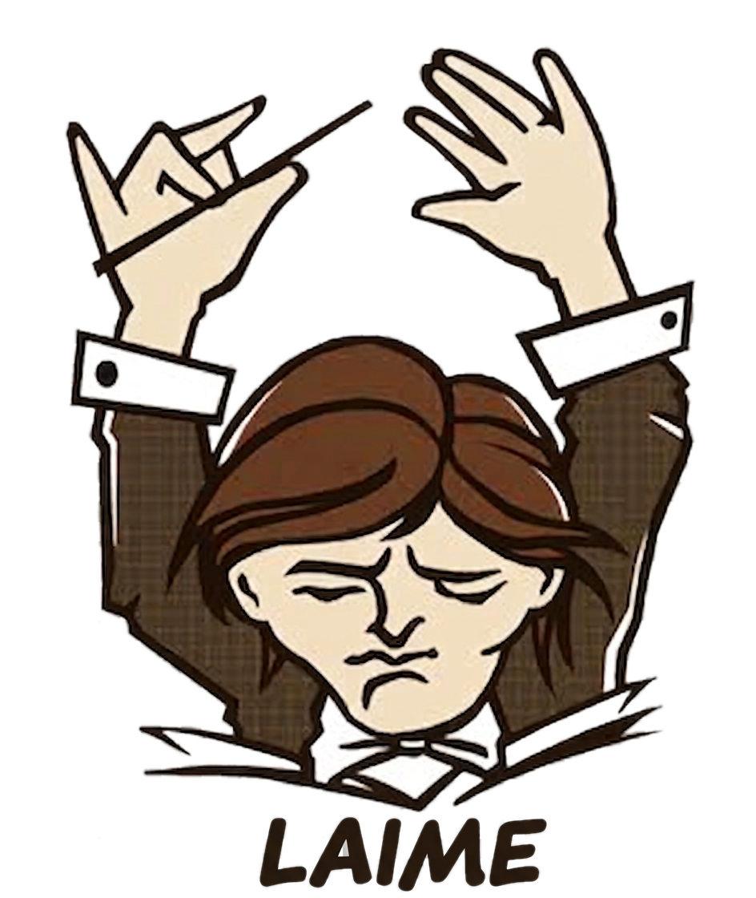
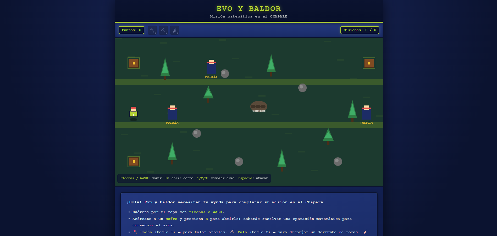
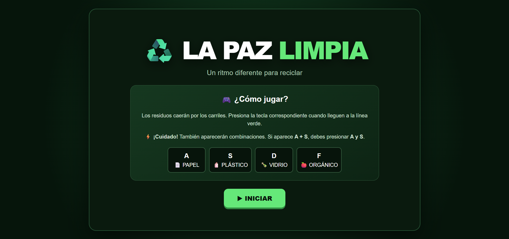
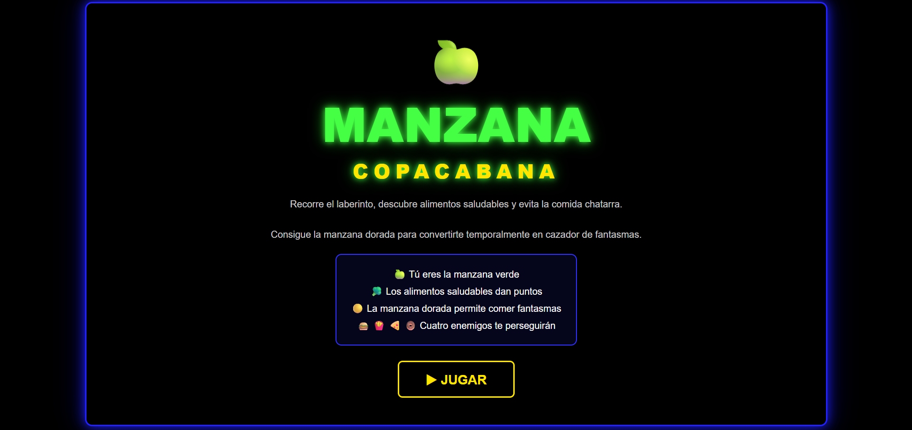
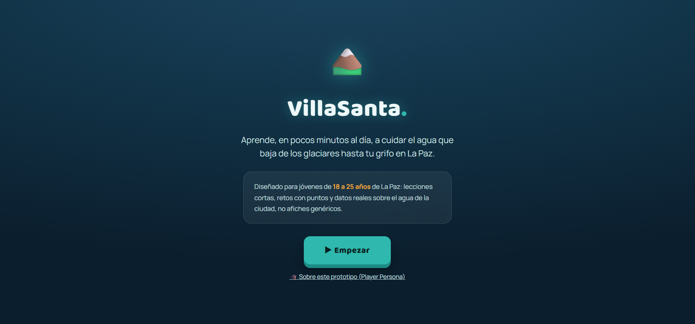
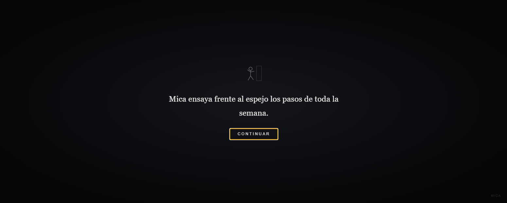
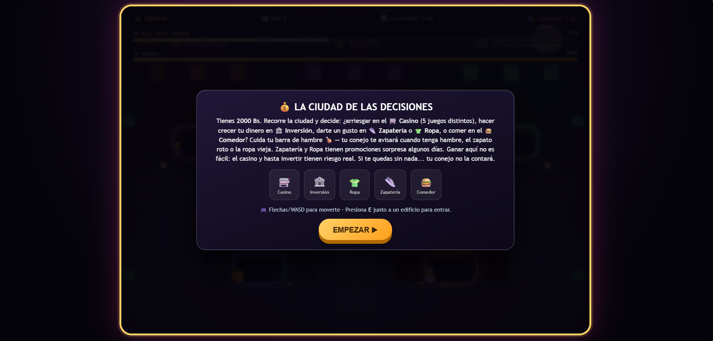

# Crishtian Laime — Portafolio de Game Development

**Seis prototipos, seis maneras de contar una historia jugable.**

**Ir a la página principal del portafolio:**

---

## Sobre mí

<!-- Completa esta sección con tu información personal -->
- **Nombre:** [Tu nombre completo]
- **Intereses relacionados con videojuegos:** [ej. diseño de niveles, juegos educativos, narrativa, pixel art...]
- **Sobre mí:** [Breve presentación personal — quién eres, qué te motiva a crear videojuegos, qué buscas aprender o lograr]

---

## Sobre este portafolio

Este repositorio reúne los prototipos y videojuegos desarrollados durante las primeras clases de la asignatura **Game Development**, como parte de la práctica *"Construcción creativa"*. Cada proyecto explora una mecánica y un mensaje distinto, combinando aprendizaje técnico con temas sociales y educativos relevantes para La Paz, Bolivia.

> **Nota sobre el tema visual:** este archivo es Markdown puro, por lo que GitHub no permite incrustar el CSS/JS de `index.html` (lo elimina por seguridad). Aun así, esta página se adapta automáticamente al tema de tu cuenta de GitHub (claro u oscuro). Para ver el diseño completo, con el mismo selector de tema que usa la galería, abre [`index.html`](./index.html) en tu navegador.

---

## Galería de videojuegos

### 01 · Evo y Baldor: Misión en el Chapare

| | |
|---|---|
| **Descripción** | RPG educativo donde el jugador resuelve operaciones matemáticas para desbloquear herramientas y avanzar en su misión por el Chapare. |
| **Género** | RPG / Educativo |
| **Tecnología** | HTML5, CSS, JavaScript |

---

### 02 · La Paz Limpia

| | |
|---|---|
| **Descripción** | Juego de ritmo donde debes clasificar residuos (papel, plástico, vidrio, orgánico) presionando la tecla correcta a tiempo. |
| **Género** | Ritmo / Arcade / Educativo |
| **Tecnología** | HTML5, CSS, JavaScript |

---

### 03 · Manzana Copacabana

| | |
|---|---|
| **Descripción** | Clon estilo Pac-Man donde una manzana verde debe comer alimentos saludables mientras evade a la comida chatarra. |
| **Género** | Arcade / Educativo |
| **Tecnología** | HTML5, CSS, JavaScript |

---

### 04 · VillaSanta — Aprende a cuidar el agua de La Paz

| | |
|---|---|
| **Descripción** | Experiencia educativa estilo mapa de niveles sobre el cuidado del agua, desde los glaciares hasta el grifo. |
| **Género** | Educativo / Puzzle |
| **Tecnología** | HTML5, CSS, JavaScript |

---

### 05 · Mica — un video, muchos caminos

| | |
|---|---|
| **Descripción** | Historia interactiva con minijuegos sobre lo que ocurre cuando un video privado se viraliza sin permiso. Cada decisión abre una rama narrativa distinta y su propio final (aislamiento, conflicto o recuperación). |
| **Género** | Narrativa interactiva |
| **Tecnología** | HTML5, CSS, JavaScript |

---

### 06 · 2000 Bs: La Ciudad de las Decisiones

| | |
|---|---|
| **Descripción** | Simulador de decisiones financieras donde administras 2000 Bs entre casino, inversión, ropa, zapatería y comida. |
| **Género** | Simulación / Estrategia |
| **Tecnología** | HTML5, CSS, JavaScript |

---

## Tecnologías utilizadas

Todos los prototipos están desarrollados con **HTML5, CSS y JavaScript puro**, sin frameworks ni motores externos, priorizando que cada juego sea autocontenido y ejecutable directamente en el navegador (basta con abrir el `.html` correspondiente, sin instalación).

## Apoyo de IA

<!-- Describe aquí qué partes fueron desarrolladas con apoyo de IA (código, arte, texto, testing, etc.) -->
[Describe qué elementos del desarrollo usaron asistencia de IA]

## Qué aprendí

<!-- TODO -->
[Reflexiona brevemente sobre lo aprendido durante el proceso: mecánicas de juego, manejo de JavaScript, diseño de UI, etc.]

## Qué mejoraría en una siguiente versión

<!-- TODO -->
[Menciona qué aspectos te gustaría pulir: balance de dificultad, arte, sonido, guardado de progreso, etc.]

---

Portafolio desarrollado para la asignatura **Game Development** — Introducción al desarrollo de videojuegos.

