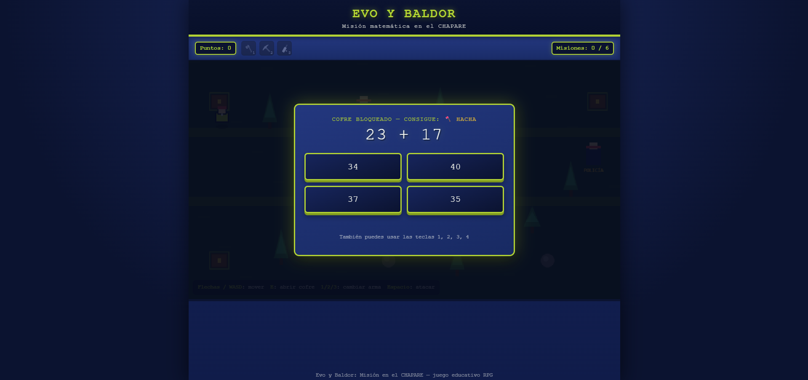

# 🌳 Evo y Baldor: Misión en el Chapare

## Descripción
Evo y Baldor necesitan ayuda para completar su misión en el Chapare. El jugador recorre un mapa boscoso, abre cofres bloqueados y resuelve operaciones matemáticas para desbloquear herramientas (hacha, pala y más) que le permiten talar árboles, despejar derrumbes y avanzar por el mapa.

- **¿De qué trata?** Un RPG educativo de exploración donde el avance no depende solo de moverse por el mapa, sino de resolver correctamente ejercicios matemáticos que aparecen al interactuar con los cofres.
- **Objetivo del jugador:** Completar las 6 misiones del mapa recolectando herramientas y despejando obstáculos (árboles, derrumbes) hasta terminar la misión.
- **Mecánica principal:** Movimiento libre por el mapa + resolución de operaciones matemáticas (suma, resta, etc.) en cofres bloqueados para obtener herramientas que despejan obstáculos específicos.

## Género
RPG / Educativo

## Motor o tecnología utilizada
HTML5, CSS y JavaScript puro (sin motor externo, un solo archivo autocontenido).

## Controles
| Tecla | Acción |
|---|---|
| Flechas / WASD | Mover al personaje |
| E | Abrir cofre |
| 1 / 2 / 3 | Cambiar de herramienta/arma |
| Espacio | Atacar |

## Capturas de pantalla

**Pantalla de inicio**

**Gameplay — resolviendo un cofre matemático**

## Cómo jugar
Abre el archivo [`evo-baldor-rpg.html`](build/evo-baldor-rpg.html) en cualquier navegador. No requiere instalación.
