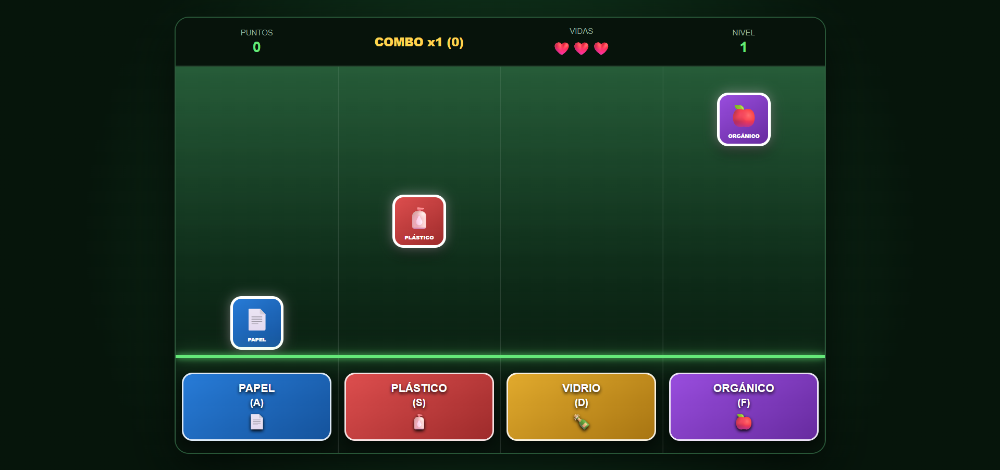

# ♻️ La Paz Limpia

## Descripción
**Un ritmo diferente para reciclar.** Los residuos caen por carriles hacia una línea de acción, y el jugador debe presionar la tecla correcta —según el tipo de material— justo cuando el residuo llega a esa línea, al estilo de un juego de ritmo (similar a Guitar Hero).

- **¿De qué trata?** Un juego de ritmo/reflejos con temática de reciclaje y separación de residuos.
- **Objetivo del jugador:** Clasificar correctamente cada residuo que cae, presionando la tecla asociada a su categoría antes de que llegue al final del carril, sumando puntos y manteniendo el combo sin perder vidas.
- **Mecánica principal:** Detección de tiempo y reacción — presionar la tecla correcta en el momento correcto. Incluye combinaciones (ej. presionar dos teclas a la vez) que aumentan la dificultad.

## Género
Ritmo / Arcade / Educativo

## Motor o tecnología utilizada
HTML5, CSS y JavaScript puro (un solo archivo autocontenido).

## Controles
| Tecla | Categoría |
|---|---|
| A | 📄 Papel |
| S | 🧴 Plástico |
| D | 🍾 Vidrio |
| F | 🍎 Orgánico |

⚡ Algunas rondas piden combinaciones, por ejemplo **A + S** simultáneamente.

## Capturas de pantalla

**Pantalla de inicio**

**Gameplay**

## Cómo jugar
Abre el archivo [`La Paz Limpia.html`](build/La%20Paz%20Limpia.html) en cualquier navegador. No requiere instalación.
