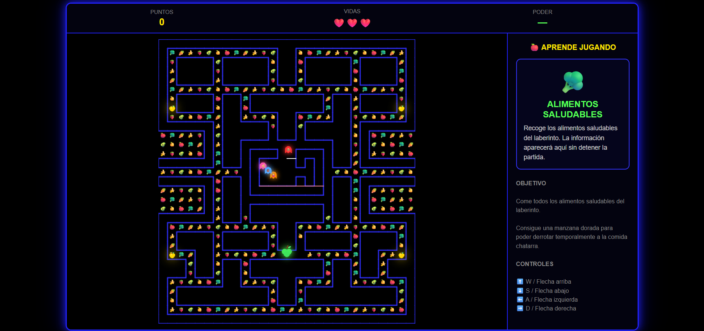

# 🍏 Manzana Copacabana

## Descripción
Recorre el laberinto, descubre alimentos saludables y evita la comida chatarra. Un homenaje al clásico Pac-Man con un mensaje de alimentación saludable: el jugador controla una manzana verde que debe comer todos los alimentos saludables del laberinto mientras escapa de cuatro enemigos representados por comida chatarra (hamburguesa, dulce, gaseosa, dona).

- **¿De qué trata?** Un clon de laberinto estilo arcade clásico con temática nutricional.
- **Objetivo del jugador:** Comer todos los alimentos saludables del laberinto sin ser atrapado por los cuatro "fantasmas" de comida chatarra que lo persiguen.
- **Mecánica principal:** Movimiento por laberinto + power-up temporal — al conseguir la manzana dorada, el jugador puede cazar temporalmente a los enemigos en lugar de huir de ellos.

## Género
Arcade / Educativo

## Motor o tecnología utilizada
HTML5, CSS y JavaScript puro (un solo archivo autocontenido).

## Controles
| Tecla | Acción |
|---|---|
| W / Flecha arriba | Mover arriba |
| S / Flecha abajo | Mover abajo |
| A / Flecha izquierda | Mover izquierda |
| D / Flecha derecha | Mover derecha |

## Capturas de pantalla

**Pantalla de inicio**

**Gameplay**

## Cómo jugar
Abre el archivo [`Manzana Copacabana.html`](build/Manzana%20Copacabana.html) en cualquier navegador. No requiere instalación.
