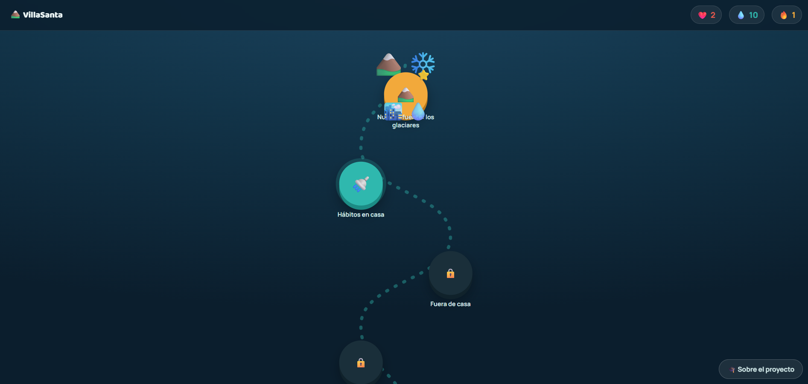

# 💧 VillaSanta — Aprende a cuidar el agua de La Paz

## Descripción
VillaSanta es una experiencia educativa que enseña, en pocos minutos al día, a cuidar el agua que baja de los glaciares hasta el grifo en La Paz. Diseñada para jóvenes de 18 a 25 años, combina lecciones cortas, retos con puntos y datos reales sobre el agua de la ciudad, evitando el formato de afiche genérico.

- **¿De qué trata?** Un juego de aprendizaje estilo mapa de niveles (similar a Duolingo) sobre el cuidado del agua, desde su origen en los glaciares hasta su uso doméstico.
- **Objetivo del jugador:** Avanzar por un mapa de nódulos desbloqueando temas (Nuestra fuente: los glaciares, Hábitos en casa, Fuera de casa, etc.), completando retos y acumulando corazones y gotas.
- **Mecánica principal:** Progresión por niveles con sistema de vidas (corazones), racha y recompensas (gotas), donde cada nivel enseña un hábito o dato concreto sobre el agua.

## Género
Educativo / Puzzle

## Motor o tecnología utilizada
HTML5, CSS y JavaScript puro (un solo archivo autocontenido).

## Controles
Interfaz basada en clics/tap: el jugador navega el mapa de niveles y responde retos usando el mouse (o pantalla táctil).

## Capturas de pantalla

**Pantalla de inicio**

**Gameplay — mapa de niveles**

## Cómo jugar
Abre el archivo [`VillaSanta.html`](build/VillaSanta.html) en cualquier navegador. No requiere instalación.
