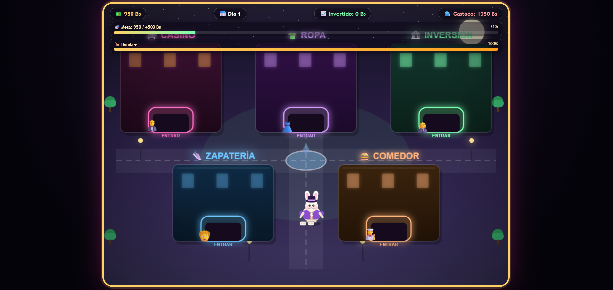

# 💰 2000 Bs: La Ciudad de las Decisiones

## Descripción
Tienes 2000 Bs. Recorre la ciudad y decide: ¿arriesgar en el Casino (5 juegos distintos), hacer crecer tu dinero en Inversión, darte un gusto en Zapatería o Ropa, o comer en el Comedor? Cuida tu barra de hambre — tu conejo te avisará cuando tenga hambre, el zapato roto o la ropa vieja. Zapatería y Ropa tienen promociones sorpresa algunos días. Ganar aquí no es fácil: el casino y hasta invertir tienen riesgo real. Si te quedas sin nada, tu conejo no la contará.

- **¿De qué trata?** Un juego de simulación económica y toma de decisiones financieras con un tono desenfadado, ambientado en una ciudad con distintos edificios (Casino, Inversión, Ropa, Zapatería, Comedor).
- **Objetivo del jugador:** Administrar 2000 Bs iniciales tomando decisiones de gasto, inversión y riesgo, mientras mantiene satisfechas las necesidades del personaje (hambre, calzado, ropa), buscando alcanzar la meta de dinero marcada sin quedarse en bancarrota.
- **Mecánica principal:** Exploración de la ciudad + gestión de recursos: cada edificio ofrece una mini-decisión distinta (apostar, invertir, comprar, comer) con su propio riesgo y recompensa, mientras una barra de hambre se degrada con el tiempo.

## Género
Simulación / Estrategia

## Motor o tecnología utilizada
HTML5, CSS y JavaScript puro (un solo archivo autocontenido).

## Controles
| Tecla / Acción | Función |
|---|---|
| Flechas / WASD | Moverse por la ciudad |
| E | Entrar a un edificio |

## Capturas de pantalla

**Pantalla de inicio**

**Gameplay — recorriendo la ciudad**

## Cómo jugar
Abre el archivo [`Ambar Casino & Club.html`](build/Ambar%20Casino%20%26%20Club.html) en cualquier navegador. No requiere instalación.
